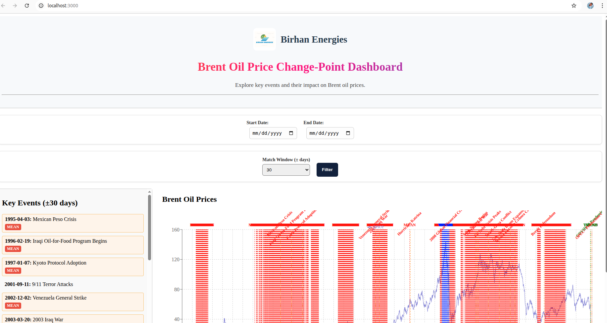
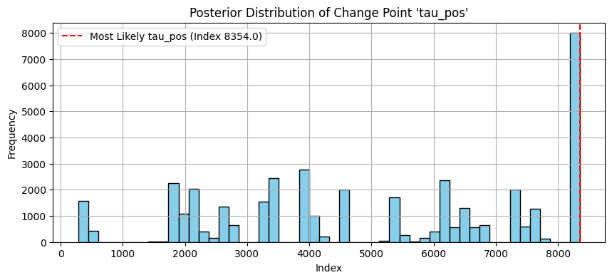
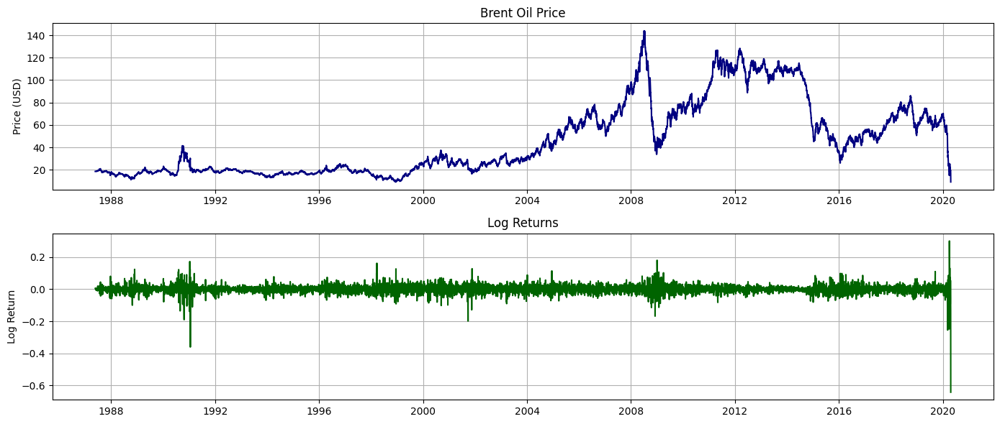
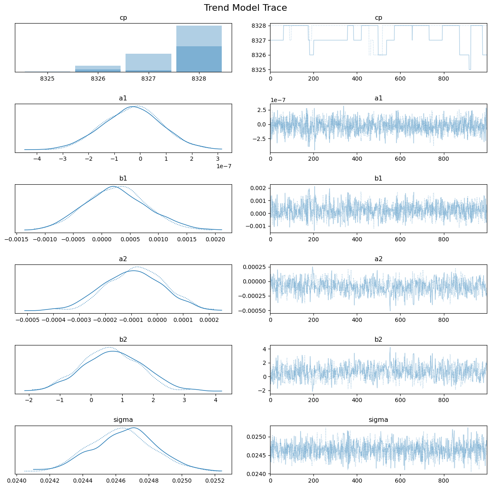

# Bayesian Change Point Detection & Interactive Dashboard for Brent Oil Price Analysis

## Overview

This project implements a Bayesian approach to detect multiple change points in Brent crude oil price time series, revealing structural shifts linked to significant global events. It also includes an interactive web dashboard built with Flask (backend) and React (frontend) to visualize analysis results, enabling users to explore how various geopolitical and economic events affect oil prices over time.

---

## Features

* Bayesian hierarchical model for multiple mean and variance change point detection
* Probabilistic inference with uncertainty quantification using PyMC3
* Integration of Brent oil price data with annotated global event timelines
* Interactive dashboard with dynamic charts and filters for data exploration
* Responsive design compatible with desktop, tablet, and mobile devices
* RESTful APIs serving analysis results for frontend consumption

---

## Project Structure

```
.
├── backend/                # Flask API and backend services
│   ├── app.py             # Main Flask app entry point
│   ├── routes/            # API endpoints
│   ├── services/          # Data processing and model services
│   └── models/            # Model loading and inference scripts
├── frontend/               # React frontend application
│   ├── public/            # Static assets
│   └── src/               # React components and utilities
├── data/                   # Raw and processed datasets
├── notebook/               # Jupyter notebooks for exploratory data analysis
├── requirements.txt        # Python dependencies
├── package.json            # Frontend dependencies (after setup)
└── README.md               # Project documentation
```

---

## Installation

### Backend Setup

1. Create and activate a Python virtual environment:

```bash
python3 -m venv venv
source venv/bin/activate  # On Windows use: venv\Scripts\activate
```

2. Install Python dependencies:

```bash
pip install -r backend/requirements.txt
```

3. Run the Flask app:

```bash
export FLASK_APP=backend/app.py
export FLASK_ENV=development  # optional for debug mode
flask run
```

The backend server will start at `http://127.0.0.1:5000`.

---

### Frontend Setup

1. Navigate to the frontend directory:

```bash
cd frontend
```

2. Install Node.js dependencies:

```bash
npm install
```

3. Start the React development server:

```bash
npm start
```

The frontend will open automatically at `http://localhost:3000` and proxy API requests to the backend.

---

## Usage

* Access the interactive dashboard via your web browser at `http://localhost:3000`.
* Use filters and date range selectors to explore change points and event impacts on Brent oil prices.
* API endpoints are available under `http://127.0.0.1:5000/api` to fetch data programmatically.

---

## Technologies Used

* **Python** with **Flask** for backend API development
* **PyMC3** for Bayesian inference and change point detection
* **React.js** for building the dynamic frontend user interface
* **Recharts** and **React Chart.js** for interactive data visualization
* **Pandas**, **NumPy** for data processing
* **Git** for version control

---

## Contributing

Contributions, issues, and feature requests are welcome! Feel free to open issues or submit pull requests.

---
## sample images





## License

This project is licensed under the MIT License - see the [LICENSE](LICENSE) file for details.

---

## Contact

Nuriye Nigus
Email: [nurye.nigus.me@gmail.com](mailto:nurye.nigus.me@@gmail.com)
LinkedIn: [linkedin.com/in/nryngs](https://linkedin.com/in/nryngs)

